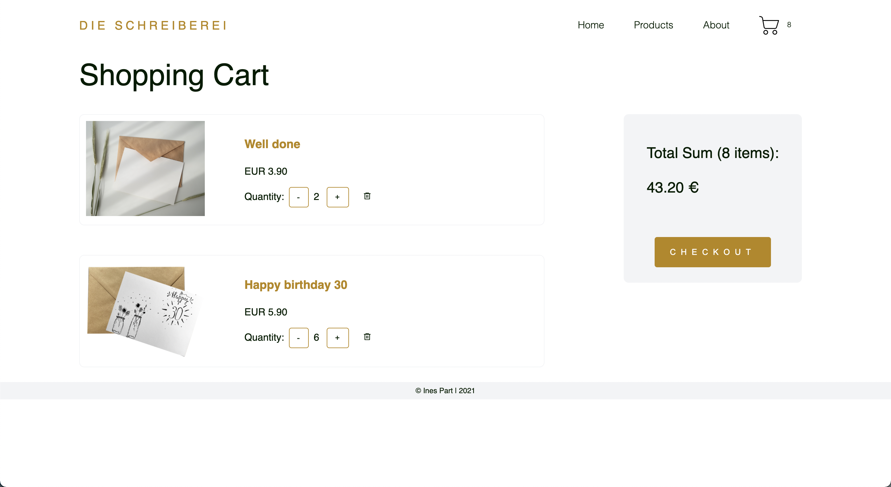
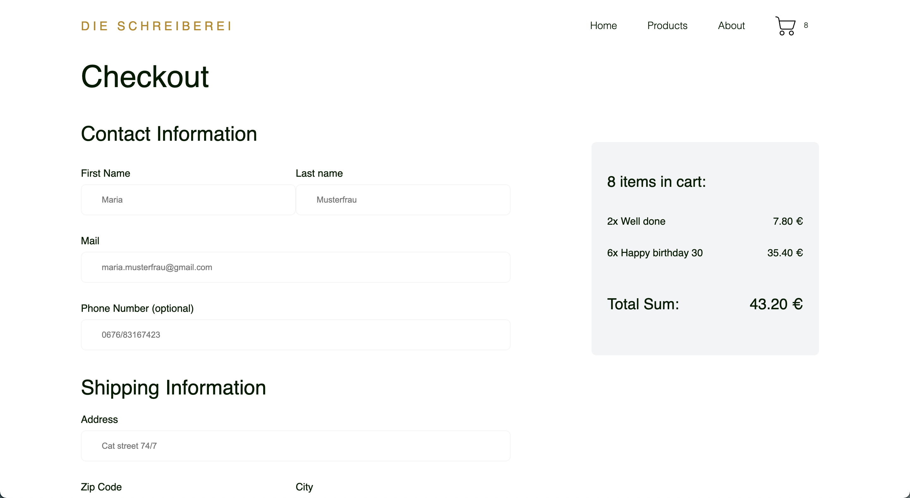

# ECommerce Store - Die Schreiberei

## Description

Visit the deployed ecommerce shop of _Die Schreiberei_ here: [https://ecommerce-die-schreiberei.herokuapp.com/](https://ecommerce-die-schreiberei.herokuapp.com/)

This ecommerce project is part of a web development course. Hence, Die Schreiberei is no actual company and no purchases can be made.

## Technologies used

- Next.js
- React
- Postgres
- PSQL
- Emotion
- Jest unit tests
- Cypress E2E tests
- Typescript
- Bootstrap

## Functionalities

- A products page where all the products are listed
- A page for each single product with the ability to add an amount to the cart
- A shopping cart page containing a list of all products that have been added to the cart with the ability to change the amount; it also shows the total price of all products
- Checkout page which shows the total and asks for shipping and payment information
- A thank you page after a checkout has been completed
- The header will show a shopping cart with the current number of items on all pages
- Responsive header and websites

## Setup instructions

- Clone the repo to your local machine with `git clone <repo>`
- Setup the database by downloading and installing PostgreSQL
- Create a user and a database
- Create a new file .env
- Copy the environment variables from .env-example into .env
- Replace the placeholders xxxxx with your username, password and name of database
- Install dotenv-cli with `yarn global add dotenv-cli`
- Run `yarn install` in your command line
- Run the migrations with `yarn migrate up`
- Start the server by running `yarn dev`

## Deploy on Heroku

The easiest way to deploy your Next.js app is to use Heroku.

- Sign up for Heroku: [signup.heroku.com](signup.heroku.com)
- Create a new App
- Choose a name and select the "Europe" Region
- Click on the button in the middle called "Connect to GitHub"
- Search for your repository in the search box at the bottom of the page and click on the "Connect" button Click on the button for "Enable Automatic Deploys"
- Go back to the Overview tab and click on "Configure Add-On"
- Search for "Postgres" and select "Heroku Postgres" from the results
- Trigger a deploy by pushing your repo to GitHub

## Screenshots

### Homepage

### Products Page

### Shopping Cart Page

### Checkout Page

